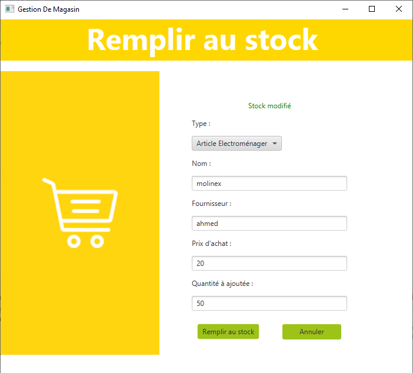

This project is a desktop application for managing a store, including inventory, sales, and more. To begin, it is necessary to import the database that I have placed in the "createDatabase" folder and din't forget to adapt the user and the password of your database in the page src/projet/Data.java in the method "connect()". The interface starts with user identification, with two types of users available: "Admin" and "Worker," each with their own system functionalities. 

In the provided database, there are already two users present: "Ikram" an Admin, and "Anass" a Worker. Both users have the same password, which is "mes."
When logging in as an Admin, this interface is displayed.

The achieved revenue is displayed at the top right corner. The various functionalities represent the different actions available on this page, such as adding an item. Our store manages two types of items: "Electroménager" and "Primeur". An error message is displayed in case of a connection error or if invalid values are entered. However, in the latter case, it still gets saved with default values. Otherwise, the item is successfully added.

The second functionality is stock replenishment for an item. If you've noticed, to properly identify an item, we only need its name, supplier, and purchase price.

You can search for an item by name, and a page will display detailed information about the items with the same searched name, each on a separate page. These functionalities, along with sorting, are primarily provided for studying the store.

We offer sorting functionalities by category, either "Electroménager" or "Primeur". It displays the items in descending order based on their stock quantity.

Same for "Primeur":

The last two functionalities involve adjusting the selling price based on a specified percentage. The "Reduce" feature reduces the selling price, while the "Increase" feature does not actually refer to a sale but rather raises the price by a certain rate.

As you see:

To return to the initial price, it is necessary to adjust the percentage, specifically using a different value than the reduction percentage.

The Worker's page includes the following functionalities:

The revenue is not displayed here because it is assumed that the employee is not directly concerned with the store's earnings, unlike the administrator. The worker can sell items, and once sold, the price to be paid is displayed.

As you see:

The other functionalities, such as search and sorting, are similar to those of an administrator. 
That's all, thank you for your attention.
